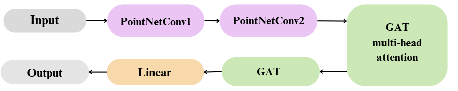

# PointNetGAT

PointNetGAT is a deep learning architecture that combines **PointNet++** and **Graph Attention Networks (GAT)** to perform segmentation on 3D left atrial meshes. It is designed to process and label anatomical structures represented as triangular meshes.

